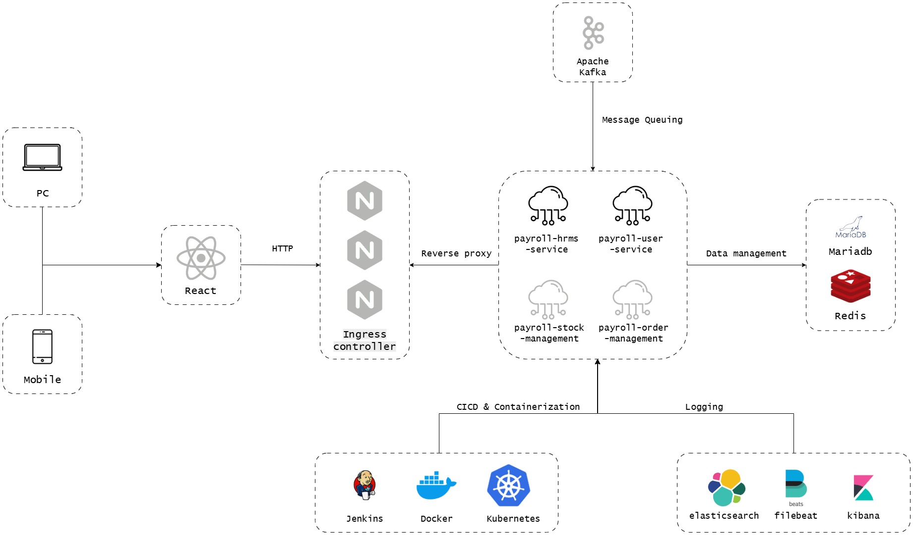

# A Human Resource Payroll Management System
A FYP project during degress study

## Tools & Frameworks
### Programming Languages
| Programming Language | Version |
| :------------------- | :------ |
| Java | 17 |
| Python | 3.12 |
| Javascript | - |
| Groovy | - |

### Back-end Microservices
1. payroll-hrms-service

| Tools | Description |
| :---- | :---------- |
| SpringBoot | Spring Boot version 3 |
| Spring Security | Spring Security Framework |
| MariaDB | MariaDB Database server |
| Hibernate | Object-Relational Mapping (ORM) tool |
| MyBatis | Object-Relational Mapping (ORM) tool |
| MyBatis Generator | MyBatis mapper generator |
| Apache Tomcat | Apache tomcat server |
| Lombok | Getter/Setter library |
| JWT | Json Web Token |
| OpenAPI | API documentation generator |

2. payroll-user-service

| Tools | Description |
| :---- | :---------- |
| FastAPI | Python HTTP framework |
| Pydantic | Python data validation library |
| MariaDB | MariaDB Database server |
| SQLAlchemy | Object-Relational Mapping (ORM) tool |
| Uvicorn | ASGI web server |
| PyJWT | Python Json Web Token library |
| Asyncio | Python asynchorize library for concurrent programming |

3. payroll-stock-management (To be implement)
4. payroll-stock-management (To be implement)

### Front-end
| Tools | Description |
| :---- | :---------- |
| React.js | React.js version 19 web UI framework |
| React native | Mobile application UI framework |
| Axios | Promise-based HTTP framework |
| Momentjs | Datetime parsing library |

# Project architecture the Human Resource Payroll Management System
